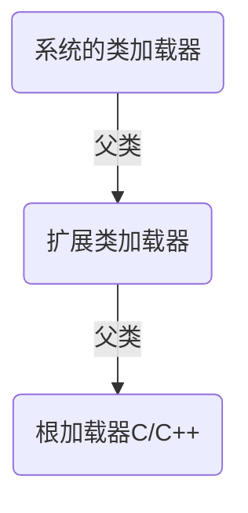

#### 内置注解与元注解

```java
//内置注解
@Override //重写超类的方法

@Deprecated //表示废弃

@SuppressWarnings //镇压警告
//元注解 用于定义注解过程
@Target(value={ElementType.METHOD,ElementType.TYPE}) //注解的作用类型 
//TYPE FIELD METHOD PARAMETER CONSTRUCTOR LOCAL_VARIABLE ANNOTATION_TYPE PACKAGE TYPE_PARAMETER TYPE_USE
@Retention(value=RetentionPolicy.RUNTIME) //注解的作用时段 
//SOURCE、CLASS、RUNTIME
    
@Documented //表示是否加入javadoc中
    
@Inherited //表示子类可以继承父类的注解
```

#### 注解定义

```java
public @interface myAnnotation{//@interface 可以定义一个注解类型
    String name() default "";//注解参数：参数类型+参数名+() 此时默认值为""
    int age();
}

```

#### 反射机制

 ```java
/*
通过反射可以获取运行时类的完整结构
Field、Method、Constructor、superClass、 Interface、Annotation
*/
//获取Class的三种方式

Person p=new Person();
Class c1=p.getClass();//实例的getClass方法
Class c2=Person.class;//class属性
Class c3=Class.forName("com.example.Person");//Class的静态方法

//获取类的运行时结构

String cn=c1.getName();//获取类的包名+类名
String cns=c1.getSimpleName();//获得类名

Field[] fields=c1.getFields();//获取public属性
fields=c1.getDeclaredFields();//找到全部属性
Field name=c1.getDeclaredField("name");//获取指定属性的值

Method[] methods=c1.getMethods();//获得本类和父类的所有public方法
methods=c1.getDeclaredMethods();//获得本类的所有方法
Method getname=c1.getDeclaredMethod("getName",null);//第一个参数为方法名，第二个参数为参数类型
Method setname=c1.getDeclaredMethod("setName",String.class);

Constructor[] constructors=c1.getConstructors();//public构造方法
constructors=c1.getDeclaredConstructors();//所有构造方法
Constructor cc=getDeclaredConstructor(String.class,int.class);//获得指定的构造器

//动态创建对象

Person p2=(Person)c1.newInstance();//调用了无参的构造方法
Constructor cc=getDeclaredConstructor(String.class,int.class);//有参的构造方法
Person p3=(Person)cc.newInstance("zfz",10);
Method setName=c1.getDeclaredMethod("setName",String.class);//获取方法
setName.invoke(p3,"qzb");//通过invoke方法调用setName函数，第一个参数为调用对象，第二参数为函数参数

Field name=c1.getDeclaredField("name");
name.setAccessible(true);//关闭安全检测 可以提高反射运行的效率
name.set(p3,"qzb");//这是私有变量的值

//通过反射获取泛型
Class<Main> c1=Main.class;
Method method=c1.getMethod("test",Map.class);
Type[] types=method.getGenericParameterTypes();//获取泛型参数类型
for (Type type : types) {
    if(type instanceof ParameterizedType){//判断是否是参数化类型
         Type[] argus=((ParameterizedType)type).getActualTypeArguments();//获取泛型中的真实类型
         for (Type argu : argus) {
             System.out.println(argu);
         }
    }
}

//通过反射获取注解
Class<Main> c1 = Main.class;
Annotation[] ans = c1.getAnnotations();//获取类的所有注解
for (Annotation an : ans) {
	System.out.println(an);
}
MyAnnotation an = (MyAnnotation)c1.getAnnotation(MyAnnotation.class);//获取类的指定注解
String value = an.value();

Field age = c1.getDeclaredField("age");//获取属性age
MyAnnotation an = age.getAnnotation(MyAnnotation.class);//获取属性age的指定注解
String value =an.value();//得到age注解中的值
 ```

#### 类加载器



